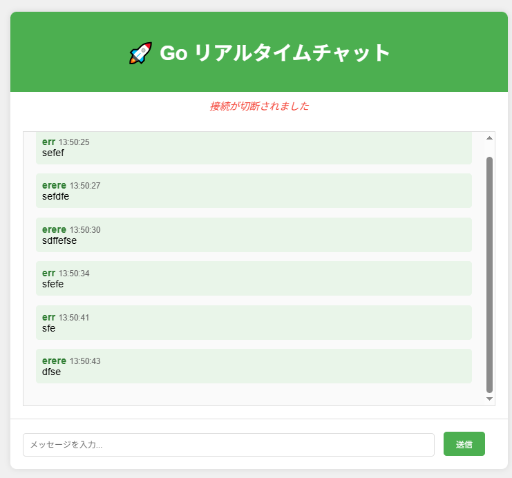

# 🚀 Go Real-time Chat App

A simple, real-time chat application built with Go and WebSockets, featuring a clean web interface for instant messaging.

[](https://golang.org/)
[](https://opensource.org/licenses/MIT)
[](https://github.com/gorilla/websocket)
[](CONTRIBUTING.md)

## ✨ Features

- **🔄 Real-time messaging** - Instant message delivery using WebSockets
- **👥 Multi-user support** - Multiple users can chat simultaneously
- **🌐 Web-based interface** - Clean, responsive HTML/CSS/JavaScript client
- **⚡ Lightweight** - Minimal dependencies, fast performance
- **🎯 Simple setup** - Get up and running in minutes
- **🌍 Cross-platform** - Works on Linux, macOS, and Windows
- **📱 Mobile-friendly** - Responsive design for mobile devices

## 🎯 Demo

🌐 **Live Demo**: [https://github.com/yuis-ice/go-chatapp-ai](https://github.com/yuis-ice/go-chatapp-ai)

### Screenshot


## 🚀 Quick Start

### Prerequisites

- **Go 1.21+** - [Download Go](https://golang.org/dl/)
- **Modern web browser** - Chrome, Firefox, Safari, or Edge

### Installation & Setup

1. **Clone the repository**
   ```bash
   git clone https://github.com/yuis-ice/go-chatapp-ai.git
   cd go-chatapp-ai
   ```

2. **Install dependencies**
   ```bash
   go mod download
   ```

3. **Run the server**
   ```bash
   go run main.go
   ```

4. **Open your browser**
   ```
   http://localhost:8080
   ```

5. **Start chatting!**
   - Enter a username
   - Join the chat room
   - Send messages in real-time

## 📁 Project Structure

```
go-chatapp-ai/
├── main.go              # WebSocket server implementation
├── go.mod               # Go module dependencies
├── go.sum               # Dependency checksums
├── static/
│   └── index.html       # Web client interface
├── .github/             # GitHub templates and workflows
├── CONTRIBUTING.md      # Contribution guidelines
├── LICENSE             # MIT license
└── README.md           # This file
```

## 🏗️ Architecture

### Backend (Go)
- **WebSocket Server**: Built with [Gorilla WebSocket](https://github.com/gorilla/websocket)
- **Connection Hub**: Manages client connections and message broadcasting
- **Static File Server**: Serves the web interface
- **Real-time Communication**: Handles user connections, disconnections, and message relay

### Frontend (HTML/CSS/JavaScript)
- **Responsive Design**: Mobile-first, clean interface
- **WebSocket Client**: Establishes and maintains server connection
- **Real-time Updates**: Instant message display and user notifications
- **Input Validation**: Client-side message validation and sanitization

### Communication Flow
```
Client A ←→ WebSocket ←→ Go Server ←→ WebSocket ←→ Client B
                            ↓
                      Message Broadcast Hub
                            ↓
                    All Connected Clients
```

## ⚙️ Configuration

### Server Configuration
- **Port**: `8080` (default)
- **Static Files**: Served from `./static/`
- **WebSocket Endpoint**: `/ws`
- **CORS**: Allowed for all origins (development mode)

### Customization Options
```go
// In main.go - modify these constants
const (
    ServerPort = ":8080"
    StaticDir  = "./static/"
    WSEndpoint = "/ws"
)
```

## 🔧 Development

### Running in Development Mode
```bash
# Run with live reload (if using air)
go install github.com/cosmtrek/air@latest
air

# Or run normally
go run main.go
```

### Building for Production
```bash
# Build binary
go build -o chat-server main.go

# Run binary
./chat-server
```

### Testing
```bash
# Run tests
go test ./...

# Run with coverage
go test -cover ./...
```

## 🚀 Deployment

### Docker (Coming Soon)
```dockerfile
# Dockerfile example
FROM golang:1.21-alpine AS builder
WORKDIR /app
COPY . .
RUN go build -o chat-server main.go

FROM alpine:latest
RUN apk --no-cache add ca-certificates
WORKDIR /root/
COPY --from=builder /app/chat-server .
COPY --from=builder /app/static ./static
EXPOSE 8080
CMD ["./chat-server"]
```

### Cloud Deployment
- **Heroku**: Ready for deployment with `Procfile`
- **DigitalOcean**: Works with App Platform
- **AWS**: Compatible with EC2, ECS, or Lambda
- **Vercel/Netlify**: Static files can be hosted separately

## 🛡️ Security Considerations

⚠️ **Important**: This is a demonstration application and should not be used in production without additional security measures.

### Current Limitations
- **No Authentication**: Anyone can join with any username
- **No HTTPS/WSS**: Communication is not encrypted
- **No Rate Limiting**: Vulnerable to spam attacks
- **CORS Wide Open**: Accepts connections from any origin
- **No Input Sanitization**: Basic XSS protection only

### For Production Use
- [ ] Implement user authentication
- [ ] Add HTTPS/WSS encryption
- [ ] Implement rate limiting
- [ ] Add proper input validation
- [ ] Configure CORS restrictions
- [ ] Add logging and monitoring
- [ ] Implement message persistence
- [ ] Add moderation features

## 🤝 Contributing

We welcome contributions from the community! Please read our [Contributing Guidelines](CONTRIBUTING.md) for details on:

- 🐛 Reporting bugs
- 🚀 Requesting features  
- 🔧 Setting up development environment
- 📝 Code style guidelines
- 🔄 Pull request process

### Quick Contribution Steps
1. Fork the repository
2. Create a feature branch (`git checkout -b feature/amazing-feature`)
3. Commit your changes (`git commit -m 'Add amazing feature'`)
4. Push to the branch (`git push origin feature/amazing-feature`)
5. Open a Pull Request

## 📄 License

This project is licensed under the MIT License - see the [LICENSE](LICENSE) file for details.

## 🙏 Acknowledgments

- **[Gorilla WebSocket](https://github.com/gorilla/websocket)** - Excellent WebSocket library for Go
- **Go Community** - For the amazing ecosystem and resources
- **Contributors** - Thank you to everyone who contributes to this project

## 📞 Support

- 🐛 **Bug Reports**: [Create an Issue](https://github.com/yuis-ice/go-chatapp-ai/issues/new?template=bug_report.yml)
- 🚀 **Feature Requests**: [Create an Issue](https://github.com/yuis-ice/go-chatapp-ai/issues/new?template=feature_request.yml)
- 💬 **Discussions**: [GitHub Discussions](https://github.com/yuis-ice/go-chatapp-ai/discussions)
- 📧 **Contact**: [jobs.fumiya@pm.me](mailto:jobs.fumiya@pm.me)

## 🔗 Related Projects

- [Gorilla WebSocket Examples](https://github.com/gorilla/websocket/tree/master/examples)
- [Go Web Development Resources](https://github.com/avelino/awesome-go#web-frameworks)
- [Real-time Communication Patterns](https://github.com/topics/websocket)

## 📈 Roadmap

### Version 1.1 (Planned)
- [ ] User authentication system
- [ ] Message history persistence
- [ ] Private messaging
- [ ] Chat rooms/channels
- [ ] File sharing support

### Version 1.2 (Future)
- [ ] Mobile app (React Native/Flutter)
- [ ] Voice/video calling
- [ ] Message encryption
- [ ] Bot integration
- [ ] Emoji reactions

---

⭐ **Star this repository if you found it helpful!**

Built with ❤️ using Go and WebSockets